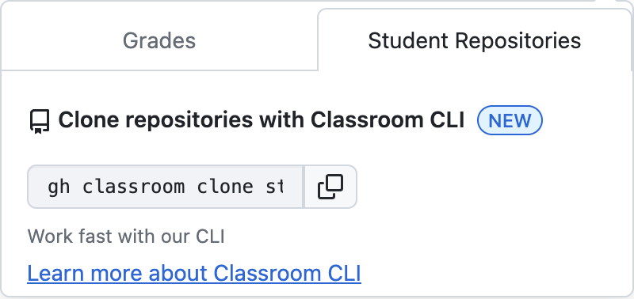
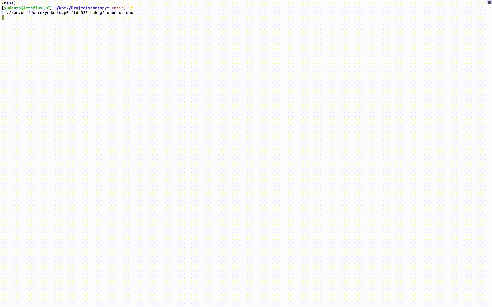

# MossPyt

A productivity tool that can do plagiarism check using Moss for all python assignment in github classroom.

## Setup

- Moss account

  - Register Moss account ([here](https://theory.stanford.edu/~aiken/moss/))

    - To obtain a Moss account, send a mail message (without subject) to <moss@moss.stanford.edu>. The body of the message should appear like the format below:

      ```text
      registeruser
      mail username@domain <-- change this to your existing email
      ```

    - After receive reply from MOSS, proceed to copy the script from the email and save it as `moss.pl` to this directory.
    - Set permission on `moss.pl` using `chmod ug+x <file>`

      ```bash
      chmod ug+x moss.pl
      ```

- Install GitHub CLI [here](https://github.com/cli/cli#installation)

## Usage

- Download all assignment from Classroom
  

  ```cmd
  gh classroom clone student-repos -a <assignment_id>
  ```

- Execute the `run.sh` file in the terminal:

  ```cmd
  ./run.sh /your/cloned/directory
  ```

- Demo:


## Reference

- [Run MOSS Plagiarism Checker on Jupyter Notebooks](https://park.is/blog_posts/20230420_running_moss_plagiarism_checker)
  by Park Ye-Joo
